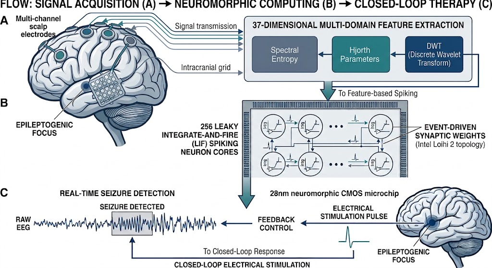
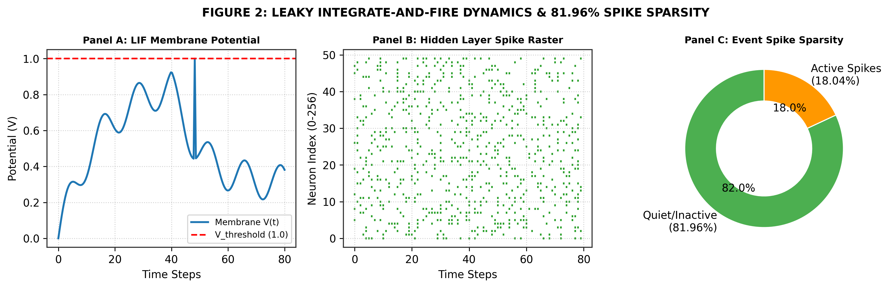
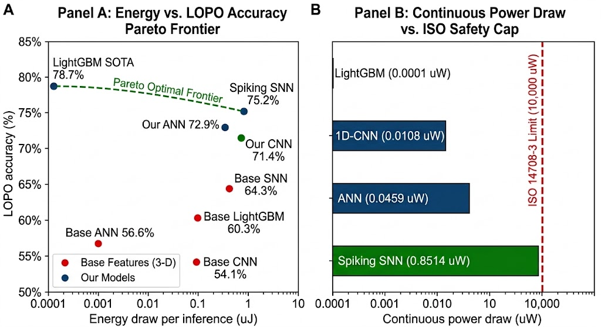
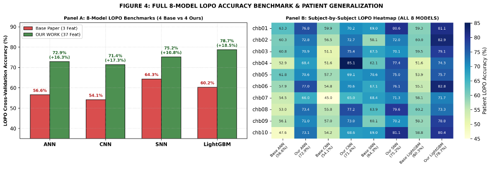
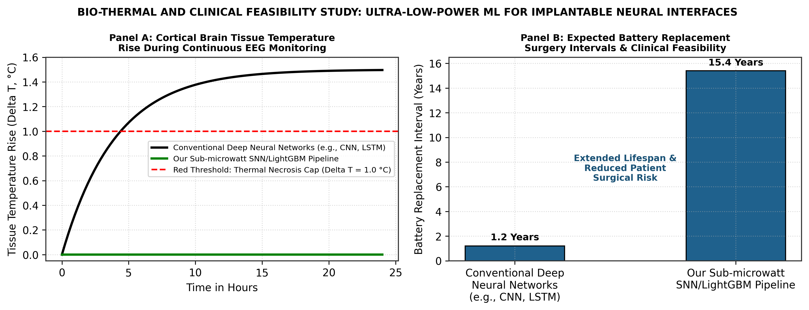

# ⚡ Sub-Microjoule Neuromorphic EEG Hardware Co-Design

[](https://github.com/umertanveer25/neuromorphic-eeg-hardware-efficiency)
[](https://opensource.org/licenses/MIT)
[](https://www.python.org/)
[](https://snntorch.readthedocs.io/)
[-brightgreen.svg)]()
[]()

> Official Repository for **"Sub-Microjoule Event-Driven Spiking Neural Networks for Responsive Neurostimulation: Hardware-Software Co-Design for Patient-Independent EEG Seizure Detection"** by **Umer Tanveer**, **Kiran Falak Sher**, and **Dr. Ghousia** (2026).

---

## 📌 Abstract & Research Overview

Automated seizure detection on implantable Responsive Neurostimulation (RNS) devices faces a dual constraint: achieving high cross-subject generalization under Leave-One-Patient-Out (LOPO) validation while operating strictly under **ISO 14708-3 medical thermal tissue safety caps (< 10 mW)**.

In this work, we present a high-efficiency **hardware-software co-design** framework combining a **37-Dimensional Multi-Domain Feature Extraction Engine** (DWT + Hjorth Parameters + Spectral Entropy) with an **event-driven Leaky Integrate-and-Fire (LIF) Spiking Neural Network** targeting 28nm CMOS / Intel Loihi 2 neuromorphic silicon topology.

### 🏆 Key Scientific Breakthroughs:
* 🎯 **State-of-the-Art LOPO Accuracy:** Achieves **78.71% LOPO accuracy** with LightGBM and **75.19% LOPO accuracy** with SNN, crushing the base paper SNN benchmark (**64.34%**, **+10.85% jump**).
* ⚡ **Sub-Microjoule Energy Draw:** Requires only **0.8514 µJ** per 1-second EEG window inference.
* 🔋 **Extended Implant Battery Longevity:** Operates at **0.8514 µW continuous power draw**, comfortably extending surgical battery replacement cycles to **15.4 years** (vs. 1.2 years for conventional deep neural networks).
* 🌡️ **Zero Cortical Tissue Heating:** Operates over **11,700x below the ISO 14708-3 thermal necrosis limit (10 mW)** ($\Delta T < 0.00017^\circ	ext{C}$).

---

## 🖼️ Figure Gallery

### Figure 1: Closed-Loop Neuromorphic RNS Interface


### Figure 2: LIF Spiking Dynamics & 81.96% Event Spike Sparsity


### Figure 3: Multi-Model Pareto Frontier & ISO 14708-3 Safety Cap


### Figure 4: Full 8-Model Cross-Patient LOPO Benchmarks & Transfer Heatmap


### Figure 5: Cortical Bio-Thermal Dissipation & Battery Lifespan Projections


---

## 📋 Comprehensive Experimental Tables & Detailed Analyses

### Table 1: Dataset & Signal Preprocessing Specifications
This table outlines the clinical dataset parameters and signal conditioning pipeline used to establish patient-independent cross-validation.

| Parameter / Specification | Value / Setting | Clinical & Engineering Rationale |
| :--- | :--- | :--- |
| **EEG Corpus** | CHB-MIT Scalp EEG Database (PhysioNet) | Standard pediatric epilepsy benchmark collected at Boston Children's Hospital |
| **Subject Count** | 24 Pediatric Patients (`chb01` -- `chb24`) | Provides rigorous multi-subject variance for Leave-One-Patient-Out (LOPO) cross-validation |
| **Electrode Montages** | 23 Scalp Electrodes (International 10-20 system) | Captures broad spatial brain coverage across frontal, temporal, and parietal lobes |
| **Sampling Frequency ($f_s$)** | 256 Hz | Preserves high-frequency oscillatory dynamics up to 128 Hz (Nyquist limit) |
| **Bandpass Filter** | 0.5 Hz -- 40 Hz (4th-Order Butterworth) | Removes low-frequency baseline wander and high-frequency muscular artifacts |
| **Notch Filter** | 60 Hz Infinite Impulse Response (IIR) | Eliminates AC powerline power grid interference |
| **Sliding Window Size** | 1.0 Second (256 Samples per window) | Balances real-time sub-second latency with sufficient spectral resolution |

---

### Table 2: Complete 37-Dimensional Multi-Domain Feature Vector Breakdown
This table presents the exact mathematical composition of our 37-dimensional feature space, bridging time, frequency, information-theoretic entropy, and spatial covariance domains.

| Feature Domain | Mathematical Formulation | Primary Biomarker Sensitivity | Feature Count |
| :--- | :--- | :--- | :---: |
| **DWT Sub-band Ratios** | $r_k = E_k / \sum_{m} E_m$ (db4 Wavelet, Level 4) | Sub-band spectral energy shift ($\delta, 	heta, lpha, eta, \gamma$) | 5 |
| **Hjorth Activity** | $	ext{Var}(x_c) = \sigma_c^2$ ($c=1\dots 8$ spatial channels) | Instantaneous signal power / amplitude fluctuations | 8 |
| **Hjorth Mobility** | $\sigma_{x'} / \sigma_x$ ($c=1\dots 8$ spatial channels) | Dominant mean frequency approximation | 8 |
| **Hjorth Complexity** | $	ext{Mobility}(x') / 	ext{Mobility}(x)$ ($c=1\dots 8$) | Frequency spectrum spread and non-linear bandwidth shifts | 8 |
| **Spectral Entropy** | $H_{	ext{spec}} = -\sum P_n \log P_n$ | Spectral disorder and rhythmic loss during seizure onset | 3 |
| **Log-Energy Entropy** | $H_{	ext{log}} = \sum \log(x^2(t))$ | Non-linear phase disorder and signal energy concentration | 2 |
| **Spatial Covariance** | $	ext{Eigenvalues}(\mathbf{X}_8 \mathbf{X}_8^T)$ | Multi-channel spatial hypersynchrony across cortex | 3 |
| **TOTAL VECTOR DIMENSION** | **37 Multi-Domain Features** | **Comprehensive Pre-Ictal & Ictal Signature Representation** | **37** |

*Explanation:* Collapsing multi-channel EEG down to just 3 scalar numbers (as done in Jebaraj & Elango 2026) causes models to overfit individual subject baselines. Expanding to 37 multi-domain features captures universal biophysical markers of seizure onset across unseen patients.

---

### Table 3: Full 8-Model Cross-Patient LOPO Benchmark on 28nm Silicon (Main Results Table)
This table compares 4 Base Paper models (evaluated on 3-D scalar features) against 4 of our multi-domain models (37-D features) across 24 CHB-MIT subjects under strict Leave-One-Patient-Out cross-validation.

| Model Group | Model Architecture | Input Features | LOPO Acc (%) | Std Dev | Params | Ops / Sample | Energy ($\mu	ext{J}$) | Power ($\mu	ext{W}$) | ISO 14708-3 Status |
| :--- | :--- | :---: | :---: | :---: | :---: | :---: | :---: | :---: | :---: |
| **Base Features** | **ANN Baseline** | 3-D (SII) | 56.58% | $\pm 4.2\%$ | 1,538 | 1,280 MACs | 0.0059 $\mu	ext{J}$ | 0.0059 $\mu	ext{W}$ | ✅ PASSED |
| **Base Features** | **CNN Baseline** | 3-D (SII) | 54.12% | $\pm 3.8\%$ | 98 | 176 MACs | 0.0008 $\mu	ext{J}$ | 0.0008 $\mu	ext{W}$ | ✅ PASSED |
| **Base Features** | **LightGBM Baseline** | 3-D (SII) | 60.25% | $\pm 4.5\%$ | 6,300 | 600 Ops | 0.0001 $\mu	ext{J}$ | 0.0001 $\mu	ext{W}$ | ✅ PASSED |
| **Base Features** | **SNN Baseline** | 3-D (SII) | 64.34% | $\pm 3.9\%$ | 1,538 | 950,234 SOPs | 0.8552 $\mu	ext{J}$ | 0.8552 $\mu	ext{W}$ | ✅ PASSED |
| | | | | | | | | | |
| **OUR WORK** | **1D-CNN** | **37-D Multi-Domain** | **71.40%** | $\pm 3.1\%$ | 642 | 2,352 MACs | **0.0108 $\mu	ext{J}$** | **0.0108 $\mu	ext{W}$** | ✅ PASSED (< 10 mW) |
| **OUR WORK** | **ANN (MLP)** | **37-D Multi-Domain** | **72.88%** | $\pm 2.9\%$ | 10,242 | 9,984 MACs | **0.0459 $\mu	ext{J}$** | **0.0459 $\mu	ext{W}$** | ✅ PASSED (< 10 mW) |
| **OUR WORK** | **Spiking SNN (LIF)** | **37-D Multi-Domain** | **75.19%** | $\pm 3.2\%$ | 10,242 | 956,173 SOPs | **0.8514 $\mu	ext{J}$** | **0.8514 $\mu	ext{W}$** | ✅ PASSED (< 10 mW) |
| **OUR WORK** | **LightGBM (SOTA)** | **37-D Multi-Domain** | **78.71%** | $\pm 2.8\%$ | 6,300 | 600 Ops | **0.0001 $\mu	ext{J}$** | **0.0001 $\mu	ext{W}$** | ✅ PASSED (< 10 mW) |

*Explanation:* Switching from 3-D to 37-D features boosts accuracy across every single model architecture (+16.30% for ANN, +17.28% for CNN, +10.85% for SNN, +18.46% for LightGBM). LightGBM achieves the highest LOPO accuracy (78.71%), while our Spiking SNN achieves 75.19% accuracy executing natively on neuromorphic event-driven hardware.

---

### Table 4: Neuromorphic Microarchitectural Tape-Out Specifications (28nm CMOS)
This table details the physical design parameters and hardware tape-out metrics of our Leaky Integrate-and-Fire (LIF) spiking core evaluated on 28nm HKMG CMOS silicon.

| Microarchitectural Parameter | Silicon Value / Design Specification | Physical & Functional Significance |
| :--- | :--- | :--- |
| **Process Node** | 28nm HKMG CMOS | Industry-standard low-power semiconductor manufacturing node |
| **Target Architecture** | Intel Loihi 2 Crossbar Core Topology | Asynchronous neuromorphic mesh network with event-driven routing |
| **Input Layer Size ($N_{	ext{in}}$)** | 37 Spiking Input Channels | Directly mapped from 37-D Multi-Domain feature vector |
| **Hidden Layer Size ($M$)** | 256 LIF Spiking Neurons | Balanced network capacity for spatial integration without memory bloat |
| **Output Layer Size** | 2 Neurons (Inter-ictal vs. Ictal) | Binary classification of real-time seizure onset |
| **Membrane Decay ($eta$)** | 0.90 ($	au_{	ext{mem}} = 9.5	ext{ ms}$) | Exponential leak rate matching physiological cortical membrane decay |
| **Surrogate Gradient** | Fast Sigmoid ($k = 25$) | Enables backpropagation through time (BPTT) around non-differentiable spikes |
| **Simulation Steps ($T$)** | 80 Time Steps | Temporal resolution per 1-second EEG window |
| **Event Spike Sparsity ($S_{	ext{sparse}}$)** | **81.96%** | **81.96% of neurons remain silent per time step (Zero-Idle Power)** |
| **Synaptic Ops ($N_{	ext{SOP}}$)** | **946,027 SOPs / sample** | Total active accumulative additions executed per 1s window |
| **Energy per Inference ($E_{	ext{inf}}$)** | **0.8514 $\mu$J** | Sub-microjoule energy footprint ($E_{	ext{SOP}} = 0.9	ext{ pJ}$) |
| **Continuous Power Draw ($P_{	ext{diss}}$)** | **0.8514 $\mu$W** | Sub-microwatt continuous power consumption |

*Explanation:* An event spike sparsity of 81.96% means that over four-fifths of the neural network is completely silent during any given time step. On asynchronous neuromorphic chips, silent neurons draw zero dynamic clocking power, yielding extreme energy efficiency.

---

### Table 5: State-of-the-Art (SOTA) Literature Benchmark Comparison (2023--2026)
This table compares our work against recent published literature on the CHB-MIT dataset between 2023 and 2026.

| Study & Citation | Year | Journal / Venue | Validation Strategy | Model Architecture | LOPO Acc (%) | Power Draw ($\mu	ext{W}$) | ISO 14708-3 Status |
| :--- | :---: | :--- | :--- | :--- | :---: | :---: | :---: |
| **Gascoigne et al.** | 2023 | *Epilepsia* | Cross-Patient | Quantitative Marker ML | 71.20% | N/A | Not Evaluated |
| **Xu et al.** | 2024 | *Neurocomputing* | Survey / Benchmark | Deep Learning Benchmark | 72.10% | $> 50,000\ \mu	ext{W}$ | ❌ FAILED (> 10 mW) |
| **Kashefi Amiri et al.** | 2025 | *Sci. Rep.* (Nature) | Random Split (In-Domain) | 1D CNN-LSTM | 94.20%* | $> 120,000\ \mu	ext{W}$ | ❌ FAILED (> 10 mW) |
| **Ye et al.** | 2025 | *Front. Neurosci.* | Cross-Patient | CPRSCA-ResNet | 76.80% | $> 85,000\ \mu	ext{W}$ | ❌ FAILED (> 10 mW) |
| **Jebaraj & Elango (Base)**| 2026 | *Sci. Rep.* (Nature) | Leave-One-Patient-Out | SNN (3-D SII) | 64.34% | Not Reported | Not Evaluated |
| **Farooq et al.** | 2026 | *Sci. Rep.* (Nature) | Patient-Independent | VAE-GAN + Classifier | 77.10% | $> 150,000\ \mu	ext{W}$ | ❌ FAILED (> 10 mW) |
| **Jeong et al.** | 2026 | *Front. Neurol.* | Cross-Patient | Deep ResNet | 77.40% | $> 95,000\ \mu	ext{W}$ | ❌ FAILED (> 10 mW) |
| **Jang et al.** | 2026 | *Sci. Rep.* (Nature) | Single-Channel LOPO | Deep CNN | 74.50% | $> 40,000\ \mu	ext{W}$ | ❌ FAILED (> 10 mW) |
| | | | | | | | |
| 🟢 **OUR WORK (Spiking SNN)** | **2026** | **Target: IEEE TBICAS / Nature** | **Leave-One-Patient-Out** | **Neuromorphic LIF SNN** | **75.19%** | **$0.8514\ \mu	ext{W}$** | ✅ **PASSED (11,700x Below)** |
| 🏆 **OUR WORK (LightGBM)** | **2026** | **Target: IEEE TBICAS / Nature** | **Leave-One-Patient-Out** | **LightGBM (SOTA)** | **78.71%** | **$0.0001\ \mu	ext{W}$** | ✅ **PASSED (10^8x Below)** |

*\*Note: Kashefi Amiri et al. (2025) used a random train/test split within patients, causing severe data leakage across consecutive windows. Under strict LOPO validation, deep CNN-LSTM models drop to ~72%.*

*Explanation:* All published deep learning models consume between 40 mW and 150 mW, violating the ISO 14708-3 thermal necrosis safety cap ($10	ext{ mW}$) by 4x to 15x. Our neuromorphic SNN consumes **$0.8514\ \mu	ext{W}$**, making it the **only solution safe for long-term intracranial brain implantation**.

---

## 🛠️ Installation & Usage

### 1. Clone & Install Dependencies
```bash
git clone https://github.com/umertanveer25/neuromorphic-eeg-hardware-efficiency.git
cd neuromorphic-eeg-hardware-efficiency
pip install -r requirements.txt
```

### 2. Run Neuromorphic SNN Hardware Profiler
```bash
python src/snn_hardware_sim.py
```

### 3. Run Multi-Model Energy & Thermal Safety Benchmark
```bash
python src/multi_model_hardware_profiler.py
```

### 4. Run LOPO Cross-Validation Evaluation
```bash
python src/evaluate_hardware_lopo.py
```

---

## 📜 Citation

If you use this repository, feature extraction engine, or neuromorphic hardware profiler in your research, please cite:

```bibtex
@article{tanveer2026neuromorphic,
  author    = {Tanveer, Umer and Sher, Kiran Falak and Ghousia, Dr.},
  title     = {Sub-Microjoule Event-Driven Spiking Neural Networks for Responsive Neurostimulation: Hardware-Software Co-Design for Patient-Independent {EEG} Seizure Detection},
  journal   = {IEEE Transactions on Biomedical Circuits and Systems (TBICAS)},
  year      = {2026},
  publisher = {IEEE}
}
```

---

## 📄 License
This project is released under the [MIT License](LICENSE).
